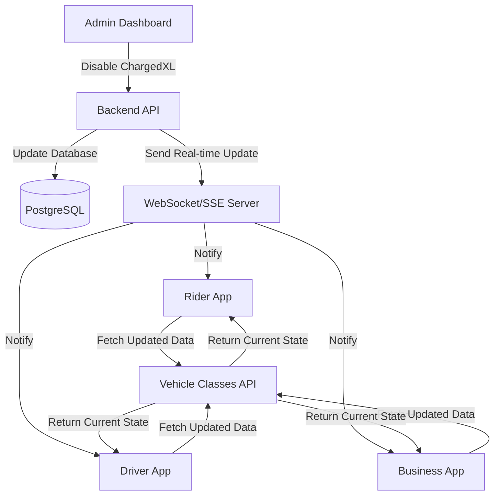

# 🚗 ChargedXL Disable Functionality - Complete Technical Specification

## 📋 Table of Contents
1. [Overview](#overview)
2. [System Architecture](#system-architecture)
3. [API Specifications](#api-specifications)
4. [Real-time Updates](#real-time-updates)
5. [Rider App Implementation](#rider-app-implementation)
6. [UI/UX Requirements](#uiux-requirements)
7. [Error Handling](#error-handling)
8. [Testing Scenarios](#testing-scenarios)
9. [Implementation Checklist](#implementation-checklist)
10. [Code Examples](#code-examples)
11. [Troubleshooting](#troubleshooting)

---

## 🎯 Overview

This document provides a complete technical specification for implementing ChargedXL disable functionality across the Charged ecosystem. When an administrator disables ChargedXL in the admin dashboard, all connected applications (rider app, driver app, business app) must immediately respond by hiding ChargedXL from their interfaces and blocking new bookings.

### Key Requirements
- **Immediate Response**: UI updates within 1-2 seconds
- **Real-time Sync**: All apps stay synchronized
- **Graceful Degradation**: App continues working if updates fail
- **User Notification**: Clear feedback when ChargedXL becomes unavailable

---

## 🏗️ System Architecture



### Data Flow
1. **Admin Action**: Admin toggles ChargedXL off in dashboard
2. **Backend Processing**: API updates database and triggers real-time notification
3. **Real-time Distribution**: WebSocket/SSE sends update to all connected clients
4. **Client Response**: Apps receive update and modify their UI accordingly
5. **State Synchronization**: Apps fetch latest data to ensure consistency

---

## 🔌 API Specifications

### 1. Vehicle Classes Endpoint

#### GET /catalog/vehicle-classes
**Purpose**: Fetch current vehicle class availability status

**Headers**:
```
Authorization: Bearer <user_token>
Content-Type: application/json
```

**Response Format**:
```json
{
  "vehicle_classes": [
    {
      "id": "vc-1",
      "code": "charged_x",
      "display_name": "Charged X",
      "is_enabled": true,
      "base_fare_cents": 500,
      "per_km_cents": 180,
      "per_min_cents": 25,
      "updated_at": "2024-01-15T10:30:00Z"
    },
    {
      "id": "vc-3",
      "code": "charged_xl",
      "display_name": "Charged XL",
      "is_enabled": false,
      "base_fare_cents": 800,
      "per_km_cents": 250,
      "per_min_cents": 35,
      "updated_at": "2024-01-15T10:30:00Z"
    }
  ],
  "pagination": {
    "page": 1,
    "page_size": 20,
    "total": 2,
    "total_pages": 1
  }
}
```

**Critical Field**: `is_enabled` - Controls vehicle visibility across all apps

### 2. Admin Vehicle Class Update

#### PUT /admin/vehicle-classes/{code}
**Purpose**: Update vehicle class status (admin only)

**Headers**:
```
Authorization: Bearer <admin_token>
Content-Type: application/json
```

**Request Body**:
```json
{
  "is_enabled": false
}
```

**Response Format**:
```json
{
  "id": "vc-3",
  "code": "charged_xl",
  "display_name": "Charged XL",
  "is_enabled": false,
  "base_fare_cents": 800,
  "per_km_cents": 250,
  "per_min_cents": 35,
  "updated_at": "2024-01-15T10:30:00Z"
}
```

---

## 📡 Real-time Updates

### WebSocket Implementation

#### Connection
```javascript
const ws = new WebSocket('wss://api.charged.com/vehicle-classes/updates');
```

#### Message Format
```json
{
  "type": "vehicle_class_update",
  "data": {
    "code": "charged_xl",
    "is_enabled": false,
    "updated_at": "2024-01-15T10:30:00Z"
  }
}
```

#### Event Handling
```javascript
ws.onmessage = (event) => {
  const message = JSON.parse(event.data);
  
  if (message.type === 'vehicle_class_update') {
    handleVehicleClassUpdate(message.data);
  }
};

const handleVehicleClassUpdate = (update) => {
  // Update local state
  updateVehicleClassStatus(update.code, update.is_enabled);
  
  // Show user notification
  if (update.code === 'charged_xl' && !update.is_enabled) {
    showNotification('ChargedXL is temporarily unavailable');
  }
};
```

### Server-Sent Events (Alternative)

#### Connection
```javascript
const eventSource = new EventSource('/api/vehicle-classes/stream');
```

#### Event Handling
```javascript
eventSource.addEventListener('vehicle_class_update', (event) => {
  const data = JSON.parse(event.data);
  handleVehicleClassUpdate(data);
});
```

---

## 📱 Rider App Implementation

### 1. State Management

#### Redux Store Structure
```typescript
interface VehicleClassState {
  vehicleClasses: VehicleClass[];
  loading: boolean;
  error: string | null;
  lastUpdated: string | null;
}

interface VehicleClass {
  id: string;
  code: string;
  display_name: string;
  is_enabled: boolean;  // Critical field
  base_fare_cents: number;
  per_km_cents: number;
  per_min_cents: number;
  updated_at: string;
}
```

#### Actions
```typescript
// Update vehicle class status
const updateVehicleClassStatus = (code: string, isEnabled: boolean) => ({
  type: 'UPDATE_VEHICLE_CLASS_STATUS',
  payload: { code, is_enabled: isEnabled }
});

// Fetch vehicle classes
const fetchVehicleClasses = () => ({
  type: 'FETCH_VEHICLE_CLASSES',
  payload: {}
});

// Set loading state
const setVehicleClassesLoading = (loading: boolean) => ({
  type: 'SET_VEHICLE_CLASSES_LOADING',
  payload: { loading }
});
```

#### Reducer
```typescript
const vehicleClassReducer = (state: VehicleClassState, action: any) => {
  switch (action.type) {
    case 'UPDATE_VEHICLE_CLASS_STATUS':
      return {
        ...state,
        vehicleClasses: state.vehicleClasses.map(vc =>
          vc.code === action.payload.code
            ? { ...vc, is_enabled: action.payload.is_enabled }
            : vc
        ),
        lastUpdated: new Date().toISOString()
      };
    
    case 'FETCH_VEHICLE_CLASSES_SUCCESS':
      return {
        ...state,
        vehicleClasses: action.payload.vehicleClasses,
        loading: false,
        error: null,
        lastUpdated: new Date().toISOString()
      };
    
    case 'FETCH_VEHICLE_CLASSES_ERROR':
      return {
        ...state,
        loading: false,
        error: action.payload.error
      };
    
    default:
      return state;
  }
};
```

### 2. Service Layer

#### Vehicle Service
```typescript
class VehicleService {
  private baseURL = 'https://api.charged.com';
  private ws: WebSocket | null = null;

  async getVehicleClasses(): Promise<VehicleClass[]> {
    try {
      const response = await fetch(`${this.baseURL}/catalog/vehicle-classes`, {
        headers: {
          'Authorization': `Bearer ${getAuthToken()}`,
          'Content-Type': 'application/json'
        }
      });

      if (!response.ok) {
        throw new Error(`HTTP error! status: ${response.status}`);
      }

      const data = await response.json();
      return data.vehicle_classes;
    } catch (error) {
      console.error('Failed to fetch vehicle classes:', error);
      throw error;
    }
  }

  subscribeToUpdates(callback: (update: any) => void): WebSocket {
    this.ws = new WebSocket('wss://api.charged.com/vehicle-classes/updates');
    
    this.ws.onopen = () => {
      console.log('Connected to vehicle class updates');
    };

    this.ws.onmessage = (event) => {
      try {
        const message = JSON.parse(event.data);
        if (message.type === 'vehicle_class_update') {
          callback(message.data);
        }
      } catch (error) {
        console.error('Failed to parse WebSocket message:', error);
      }
    };

    this.ws.onclose = () => {
      console.log('Disconnected from vehicle class updates');
      // Attempt to reconnect after 5 seconds
      setTimeout(() => {
        this.subscribeToUpdates(callback);
      }, 5000);
    };

    this.ws.onerror = (error) => {
      console.error('WebSocket error:', error);
    };

    return this.ws;
  }

  disconnect() {
    if (this.ws) {
      this.ws.close();
      this.ws = null;
    }
  }
}
```

### 3. React Components

#### Vehicle Selection Component
```typescript
import React, { useEffect, useState } from 'react';
import { useSelector, useDispatch } from 'react-redux';

const VehicleSelection: React.FC = () => {
  const dispatch = useDispatch();
  const { vehicleClasses, loading, error } = useSelector((state: any) => state.vehicleClasses);
  const [updating, setUpdating] = useState(false);

  // Filter to only show enabled vehicles
  const availableVehicles = vehicleClasses.filter((vc: VehicleClass) => vc.is_enabled);

  useEffect(() => {
    // Fetch initial data
    dispatch(fetchVehicleClasses());

    // Subscribe to real-time updates
    const vehicleService = new VehicleService();
    const ws = vehicleService.subscribeToUpdates((update) => {
      setUpdating(true);
      dispatch(updateVehicleClassStatus(update.code, update.is_enabled));
      
      // Show notification for ChargedXL changes
      if (update.code === 'charged_xl') {
        const message = update.is_enabled 
          ? 'ChargedXL is now available!' 
          : 'ChargedXL is temporarily unavailable';
        showToast(message, update.is_enabled ? 'success' : 'info');
      }
      
      setTimeout(() => setUpdating(false), 1000);
    });

    return () => {
      vehicleService.disconnect();
    };
  }, [dispatch]);

  if (loading) {
    return <LoadingSpinner />;
  }

  if (error) {
    return <ErrorMessage message={error} onRetry={() => dispatch(fetchVehicleClasses())} />;
  }

  return (
    <div className="vehicle-selection">
      {updating && <UpdateIndicator />}
      
      <h2>Choose Your Vehicle</h2>
      
      <div className="vehicle-grid">
        {availableVehicles.map((vehicle: VehicleClass) => (
          <VehicleCard
            key={vehicle.code}
            vehicle={vehicle}
            onSelect={handleVehicleSelect}
          />
        ))}
      </div>
      
      {availableVehicles.length === 0 && (
        <EmptyState message="No vehicles available at the moment" />
      )}
    </div>
  );
};
```

#### Vehicle Card Component
```typescript
interface VehicleCardProps {
  vehicle: VehicleClass;
  onSelect: (vehicle: VehicleClass) => void;
}

const VehicleCard: React.FC<VehicleCardProps> = ({ vehicle, onSelect }) => {
  const isEnabled = vehicle.is_enabled;

  return (
    <div 
      className={`vehicle-card ${!isEnabled ? 'disabled' : ''}`}
      onClick={() => isEnabled && onSelect(vehicle)}
    >
      <div className="vehicle-icon">
        <VehicleIcon type={vehicle.code} />
      </div>
      
      <div className="vehicle-info">
        <h3>{vehicle.display_name}</h3>
        <p className="vehicle-code">{vehicle.code}</p>
        
        {!isEnabled && (
          <div className="unavailable-badge">
            Temporarily Unavailable
          </div>
        )}
      </div>
      
      <div className="vehicle-pricing">
        <span className="base-fare">
          ${(vehicle.base_fare_cents / 100).toFixed(2)} base
        </span>
        <span className="per-km">
          ${(vehicle.per_km_cents / 100).toFixed(2)}/km
        </span>
      </div>
    </div>
  );
};
```

### 4. Booking Flow Integration

#### Booking Validation
```typescript
const useBookingValidation = () => {
  const { vehicleClasses } = useSelector((state: any) => state.vehicleClasses);

  const canBookVehicle = (vehicleCode: string): boolean => {
    const vehicle = vehicleClasses.find((vc: VehicleClass) => vc.code === vehicleCode);
    return vehicle?.is_enabled === true;
  };

  const validateBooking = (selectedVehicle: string): ValidationResult => {
    if (!canBookVehicle(selectedVehicle)) {
      return {
        valid: false,
        error: 'Selected vehicle is no longer available',
        code: 'VEHICLE_UNAVAILABLE'
      };
    }
    
    return { valid: true };
  };

  return { canBookVehicle, validateBooking };
};
```

#### Booking Component
```typescript
const BookingFlow: React.FC = () => {
  const { validateBooking } = useBookingValidation();
  const [selectedVehicle, setSelectedVehicle] = useState<string>('');

  const handleBooking = async () => {
    const validation = validateBooking(selectedVehicle);
    
    if (!validation.valid) {
      showToast(validation.error, 'error');
      return;
    }

    // Proceed with booking
    try {
      await createBooking(selectedVehicle);
      showToast('Booking created successfully!', 'success');
    } catch (error) {
      showToast('Failed to create booking', 'error');
    }
  };

  return (
    <div className="booking-flow">
      {/* Vehicle selection and booking form */}
      <button 
        onClick={handleBooking}
        disabled={!selectedVehicle}
      >
        Book Now
      </button>
    </div>
  );
};
```

---

## 🎨 UI/UX Requirements

### 1. Visual States

#### Enabled Vehicle
- ✅ Normal appearance
- ✅ Clickable/selectable
- ✅ Full pricing visible
- ✅ No visual indicators

#### Disabled Vehicle
- ❌ Grayed out appearance
- ❌ Not clickable
- ❌ "Temporarily Unavailable" badge
- ❌ Reduced opacity (0.6)

### 2. Loading States

#### During Updates
```typescript
const UpdateIndicator: React.FC = () => (
  <div className="update-indicator">
    <Spinner size="small" />
    <span>Updating vehicle options...</span>
  </div>
);
```

#### During Initial Load
```typescript
const LoadingSpinner: React.FC = () => (
  <div className="loading-container">
    <Spinner size="large" />
    <p>Loading vehicle options...</p>
  </div>
);
```

### 3. User Notifications

#### Toast Notifications
```typescript
const showToast = (message: string, type: 'success' | 'error' | 'info') => {
  // Implementation depends on your toast library
  toast[type](message, {
    duration: type === 'error' ? 5000 : 3000,
    position: 'top-right'
  });
};
```

#### In-App Messages
```typescript
const VehicleUnavailableMessage: React.FC = () => (
  <div className="unavailable-message">
    <Icon name="warning" />
    <div>
      <h3>ChargedXL Temporarily Unavailable</h3>
      <p>This vehicle type is currently not available. Please select another option.</p>
    </div>
  </div>
);
```

---

## 🛠️ Error Handling

### 1. API Failure Scenarios

#### Network Error
```typescript
const handleApiError = (error: Error) => {
  console.error('API Error:', error);
  
  // Try to use cached data
  const cachedData = localStorage.getItem('vehicle_classes');
  if (cachedData) {
    const parsed = JSON.parse(cachedData);
    dispatch(setVehicleClasses(parsed));
    showToast('Using cached data - some options may be outdated', 'warning');
    return;
  }
  
  // Last resort: assume all vehicles are enabled
  dispatch(setVehicleClasses(DEFAULT_VEHICLE_CLASSES));
  showToast('Unable to load vehicle options - using defaults', 'error');
};
```

#### Authentication Error
```typescript
const handleAuthError = () => {
  // Redirect to login
  dispatch(logout());
  router.push('/login');
};
```

### 2. Connection Loss Handling

#### WebSocket Reconnection
```typescript
class ReconnectingWebSocket {
  private ws: WebSocket | null = null;
  private reconnectAttempts = 0;
  private maxReconnectAttempts = 5;
  private reconnectDelay = 1000;

  connect() {
    this.ws = new WebSocket('wss://api.charged.com/vehicle-classes/updates');
    
    this.ws.onopen = () => {
      this.reconnectAttempts = 0;
      console.log('WebSocket connected');
    };

    this.ws.onclose = () => {
      console.log('WebSocket disconnected');
      this.attemptReconnect();
    };

    this.ws.onerror = (error) => {
      console.error('WebSocket error:', error);
    };
  }

  private attemptReconnect() {
    if (this.reconnectAttempts < this.maxReconnectAttempts) {
      this.reconnectAttempts++;
      const delay = this.reconnectDelay * Math.pow(2, this.reconnectAttempts - 1);
      
      setTimeout(() => {
        console.log(`Attempting to reconnect (${this.reconnectAttempts}/${this.maxReconnectAttempts})`);
        this.connect();
      }, delay);
    } else {
      console.error('Max reconnection attempts reached');
      // Fall back to polling
      this.startPolling();
    }
  }

  private startPolling() {
    setInterval(async () => {
      try {
        const vehicleClasses = await vehicleService.getVehicleClasses();
        dispatch(setVehicleClasses(vehicleClasses));
      } catch (error) {
        console.error('Polling failed:', error);
      }
    }, 30000); // Poll every 30 seconds
  }
}
```

### 3. Graceful Degradation

#### Offline Mode
```typescript
const useOfflineMode = () => {
  const [isOnline, setIsOnline] = useState(navigator.onLine);

  useEffect(() => {
    const handleOnline = () => {
      setIsOnline(true);
      // Refresh data when coming back online
      dispatch(fetchVehicleClasses());
    };

    const handleOffline = () => {
      setIsOnline(false);
      showToast('You are offline - using cached data', 'warning');
    };

    window.addEventListener('online', handleOnline);
    window.addEventListener('offline', handleOffline);

    return () => {
      window.removeEventListener('online', handleOnline);
      window.removeEventListener('offline', handleOffline);
    };
  }, [dispatch]);

  return { isOnline };
};
```

---

## 🧪 Testing Scenarios

### 1. Happy Path Testing

#### Test Case 1: Normal Disable Flow
1. **Setup**: Rider app is running and connected
2. **Action**: Admin disables ChargedXL in dashboard
3. **Expected**: 
   - ChargedXL disappears from vehicle selection within 2 seconds
   - User sees notification: "ChargedXL is temporarily unavailable"
   - Pricing updates to remove ChargedXL options
   - No ChargedXL bookings can be created

#### Test Case 2: Normal Enable Flow
1. **Setup**: ChargedXL is disabled, rider app is running
2. **Action**: Admin enables ChargedXL in dashboard
3. **Expected**:
   - ChargedXL appears in vehicle selection within 2 seconds
   - User sees notification: "ChargedXL is now available!"
   - Pricing updates to include ChargedXL options
   - ChargedXL bookings can be created

### 2. Error Scenario Testing

#### Test Case 3: API Failure
1. **Setup**: Rider app is running
2. **Action**: Backend API becomes unavailable
3. **Expected**:
   - App shows warning: "Using cached data - some options may be outdated"
   - App continues working with last known vehicle states
   - User can still book with available vehicles

#### Test Case 4: Connection Loss
1. **Setup**: Rider app is connected to WebSocket
2. **Action**: Network connection is lost
3. **Expected**:
   - App attempts to reconnect automatically
   - After max attempts, falls back to polling
   - App continues working with last known data

#### Test Case 5: Stale Data
1. **Setup**: App has been backgrounded for extended period
2. **Action**: App returns to foreground
3. **Expected**:
   - App immediately fetches latest vehicle classes
   - UI updates with current vehicle availability
   - User sees any changes that occurred while app was backgrounded

### 3. Edge Case Testing

#### Test Case 6: Mid-Booking Disable
1. **Setup**: User is in the middle of booking ChargedXL
2. **Action**: Admin disables ChargedXL
3. **Expected**:
   - Booking flow is interrupted
   - User sees message: "Selected vehicle is no longer available"
   - User is redirected to vehicle selection
   - ChargedXL is not available for selection

#### Test Case 7: Multiple Rapid Changes
1. **Setup**: Rider app is running
2. **Action**: Admin rapidly toggles ChargedXL on/off multiple times
3. **Expected**:
   - App handles all updates correctly
   - UI reflects the final state
   - No race conditions or inconsistent states

---

## ✅ Implementation Checklist

### Backend Integration
- [ ] **API Endpoints**
  - [ ] Implement GET /catalog/vehicle-classes
  - [ ] Add proper authentication
  - [ ] Include error handling
  - [ ] Add rate limiting

- [ ] **Real-time Updates**
  - [ ] Set up WebSocket server
  - [ ] Implement message broadcasting
  - [ ] Add connection management
  - [ ] Include fallback to SSE

- [ ] **Database**
  - [ ] Ensure vehicle_classes table has is_enabled column
  - [ ] Add proper indexing
  - [ ] Include audit logging

### Frontend Implementation
- [ ] **State Management**
  - [ ] Add vehicle classes to Redux/Context
  - [ ] Implement update actions
  - [ ] Add error states
  - [ ] Include loading states

- [ ] **UI Components**
  - [ ] Update vehicle selection screen
  - [ ] Modify booking flow
  - [ ] Add loading indicators
  - [ ] Include error messages

- [ ] **Real-time Updates**
  - [ ] Implement WebSocket connection
  - [ ] Add reconnection logic
  - [ ] Include fallback to polling
  - [ ] Handle connection errors

- [ ] **Error Handling**
  - [ ] Add API failure handling
  - [ ] Implement offline mode
  - [ ] Include retry mechanisms
  - [ ] Add user notifications

### Testing
- [ ] **Unit Tests**
  - [ ] Test state management
  - [ ] Test API calls
  - [ ] Test error handling
  - [ ] Test UI components

- [ ] **Integration Tests**
  - [ ] Test real-time updates
  - [ ] Test API failure scenarios
  - [ ] Test connection loss
  - [ ] Test offline mode

- [ ] **End-to-End Tests**
  - [ ] Test complete disable flow
  - [ ] Test complete enable flow
  - [ ] Test error scenarios
  - [ ] Test edge cases

### Monitoring
- [ ] **Analytics**
  - [ ] Track vehicle class changes
  - [ ] Monitor update delivery times
  - [ ] Track error rates
  - [ ] Measure user impact

- [ ] **Logging**
  - [ ] Log all vehicle class updates
  - [ ] Log API errors
  - [ ] Log connection issues
  - [ ] Log user actions

---

## 🔧 Code Examples

### Complete React Hook Implementation
```typescript
import { useState, useEffect, useCallback } from 'react';
import { useSelector, useDispatch } from 'react-redux';

export const useVehicleClasses = () => {
  const dispatch = useDispatch();
  const { vehicleClasses, loading, error } = useSelector((state: any) => state.vehicleClasses);
  const [ws, setWs] = useState<WebSocket | null>(null);

  const fetchVehicleClasses = useCallback(async () => {
    try {
      dispatch(setVehicleClassesLoading(true));
      const classes = await vehicleService.getVehicleClasses();
      dispatch(setVehicleClasses(classes));
    } catch (error) {
      dispatch(setVehicleClassesError(error.message));
    } finally {
      dispatch(setVehicleClassesLoading(false));
    }
  }, [dispatch]);

  const subscribeToUpdates = useCallback(() => {
    const websocket = vehicleService.subscribeToUpdates((update) => {
      dispatch(updateVehicleClassStatus(update.code, update.is_enabled));
      
      if (update.code === 'charged_xl') {
        const message = update.is_enabled 
          ? 'ChargedXL is now available!' 
          : 'ChargedXL is temporarily unavailable';
        showToast(message, update.is_enabled ? 'success' : 'info');
      }
    });
    
    setWs(websocket);
    return websocket;
  }, [dispatch]);

  useEffect(() => {
    fetchVehicleClasses();
    const websocket = subscribeToUpdates();
    
    return () => {
      websocket.close();
    };
  }, [fetchVehicleClasses, subscribeToUpdates]);

  const availableVehicles = vehicleClasses.filter((vc: VehicleClass) => vc.is_enabled);
  const canBookVehicle = (vehicleCode: string) => {
    return availableVehicles.some(vc => vc.code === vehicleCode);
  };

  return {
    vehicleClasses,
    availableVehicles,
    loading,
    error,
    canBookVehicle,
    refresh: fetchVehicleClasses
  };
};
```

### Complete Service Implementation
```typescript
class VehicleClassService {
  private baseURL = process.env.REACT_APP_API_URL;
  private ws: WebSocket | null = null;
  private reconnectAttempts = 0;
  private maxReconnectAttempts = 5;
  private reconnectDelay = 1000;

  async getVehicleClasses(): Promise<VehicleClass[]> {
    try {
      const response = await fetch(`${this.baseURL}/catalog/vehicle-classes`, {
        headers: {
          'Authorization': `Bearer ${this.getAuthToken()}`,
          'Content-Type': 'application/json'
        }
      });

      if (!response.ok) {
        throw new Error(`HTTP error! status: ${response.status}`);
      }

      const data = await response.json();
      
      // Cache the data
      localStorage.setItem('vehicle_classes', JSON.stringify(data.vehicle_classes));
      localStorage.setItem('vehicle_classes_timestamp', Date.now().toString());
      
      return data.vehicle_classes;
    } catch (error) {
      console.error('Failed to fetch vehicle classes:', error);
      
      // Try to use cached data
      const cached = this.getCachedVehicleClasses();
      if (cached) {
        console.log('Using cached vehicle classes');
        return cached;
      }
      
      throw error;
    }
  }

  private getCachedVehicleClasses(): VehicleClass[] | null {
    try {
      const cached = localStorage.getItem('vehicle_classes');
      const timestamp = localStorage.getItem('vehicle_classes_timestamp');
      
      if (cached && timestamp) {
        const age = Date.now() - parseInt(timestamp);
        // Use cached data if it's less than 1 hour old
        if (age < 3600000) {
          return JSON.parse(cached);
        }
      }
    } catch (error) {
      console.error('Failed to parse cached vehicle classes:', error);
    }
    
    return null;
  }

  subscribeToUpdates(callback: (update: any) => void): WebSocket {
    this.ws = new WebSocket(`${this.baseURL.replace('http', 'ws')}/vehicle-classes/updates`);
    
    this.ws.onopen = () => {
      console.log('Connected to vehicle class updates');
      this.reconnectAttempts = 0;
    };

    this.ws.onmessage = (event) => {
      try {
        const message = JSON.parse(event.data);
        if (message.type === 'vehicle_class_update') {
          callback(message.data);
        }
      } catch (error) {
        console.error('Failed to parse WebSocket message:', error);
      }
    };

    this.ws.onclose = () => {
      console.log('Disconnected from vehicle class updates');
      this.attemptReconnect(callback);
    };

    this.ws.onerror = (error) => {
      console.error('WebSocket error:', error);
    };

    return this.ws;
  }

  private attemptReconnect(callback: (update: any) => void) {
    if (this.reconnectAttempts < this.maxReconnectAttempts) {
      this.reconnectAttempts++;
      const delay = this.reconnectDelay * Math.pow(2, this.reconnectAttempts - 1);
      
      setTimeout(() => {
        console.log(`Attempting to reconnect (${this.reconnectAttempts}/${this.maxReconnectAttempts})`);
        this.subscribeToUpdates(callback);
      }, delay);
    } else {
      console.error('Max reconnection attempts reached, falling back to polling');
      this.startPolling(callback);
    }
  }

  private startPolling(callback: (update: any) => void) {
    setInterval(async () => {
      try {
        const vehicleClasses = await this.getVehicleClasses();
        // Notify about any changes
        callback({ type: 'vehicle_class_update', data: vehicleClasses });
      } catch (error) {
        console.error('Polling failed:', error);
      }
    }, 30000); // Poll every 30 seconds
  }

  private getAuthToken(): string {
    // Implementation depends on your auth system
    return localStorage.getItem('auth_token') || '';
  }

  disconnect() {
    if (this.ws) {
      this.ws.close();
      this.ws = null;
    }
  }
}

export const vehicleService = new VehicleClassService();
```

---

## 🐛 Troubleshooting

### Common Issues

#### 1. Vehicle Classes Not Updating
**Symptoms**: UI doesn't reflect changes made in admin dashboard
**Causes**:
- WebSocket connection failed
- API endpoint not responding
- State not being updated properly

**Solutions**:
```typescript
// Check WebSocket connection
if (ws.readyState !== WebSocket.OPEN) {
  console.log('WebSocket not connected, attempting to reconnect');
  reconnect();
}

// Verify API endpoint
const response = await fetch('/catalog/vehicle-classes');
console.log('API response:', response);

// Check state updates
console.log('Current vehicle classes:', vehicleClasses);
```

#### 2. Stale Data Issues
**Symptoms**: App shows outdated vehicle availability
**Causes**:
- Cached data is too old
- Real-time updates not working
- App was backgrounded for too long

**Solutions**:
```typescript
// Check cache age
const timestamp = localStorage.getItem('vehicle_classes_timestamp');
const age = Date.now() - parseInt(timestamp);
if (age > 3600000) { // 1 hour
  console.log('Cache too old, refreshing data');
  fetchVehicleClasses();
}

// Force refresh on app resume
document.addEventListener('visibilitychange', () => {
  if (!document.hidden) {
    fetchVehicleClasses();
  }
});
```

#### 3. Connection Issues
**Symptoms**: Real-time updates stop working
**Causes**:
- Network connectivity issues
- WebSocket server problems
- Authentication token expired

**Solutions**:
```typescript
// Implement connection health check
const checkConnection = () => {
  if (ws.readyState === WebSocket.CLOSED) {
    console.log('Connection lost, attempting to reconnect');
    reconnect();
  }
};

// Check authentication
const checkAuth = () => {
  const token = getAuthToken();
  if (!token || isTokenExpired(token)) {
    console.log('Token expired, redirecting to login');
    redirectToLogin();
  }
};
```

### Debug Tools

#### 1. Console Logging
```typescript
// Enable debug logging
const DEBUG = process.env.NODE_ENV === 'development';

const log = (message: string, data?: any) => {
  if (DEBUG) {
    console.log(`[VehicleClasses] ${message}`, data);
  }
};

// Use throughout the code
log('Fetching vehicle classes');
log('Received update', update);
log('WebSocket connected');
```

#### 2. State Inspector
```typescript
// Add to Redux DevTools
const store = createStore(
  rootReducer,
  window.__REDUX_DEVTOOLS_EXTENSION__ && window.__REDUX_DEVTOOLS_EXTENSION__()
);

// Log state changes
store.subscribe(() => {
  console.log('State changed:', store.getState().vehicleClasses);
});
```

#### 3. Network Monitoring
```typescript
// Monitor API calls
const originalFetch = window.fetch;
window.fetch = (...args) => {
  console.log('API call:', args[0]);
  return originalFetch(...args).then(response => {
    console.log('API response:', response.status, response.statusText);
    return response;
  });
};

// Monitor WebSocket messages
ws.onmessage = (event) => {
  console.log('WebSocket message received:', event.data);
  // ... rest of handler
};
```

---

## 📞 Support

For technical support or questions about this implementation:

- **Backend Issues**: Contact backend team
- **Frontend Issues**: Contact frontend team
- **Integration Issues**: Contact platform team
- **Emergency**: Contact on-call engineer

---

## 📝 Changelog

### Version 1.0.0 (2024-01-15)
- Initial implementation
- WebSocket real-time updates
- Complete error handling
- Comprehensive testing scenarios

---

*This document is maintained by the Charged platform team. Last updated: January 15, 2024*
